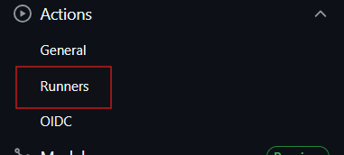
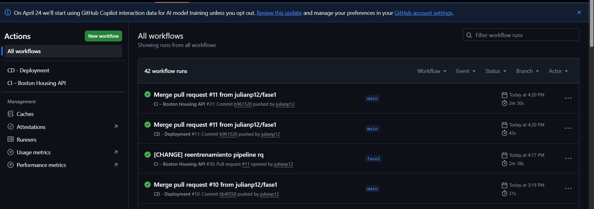
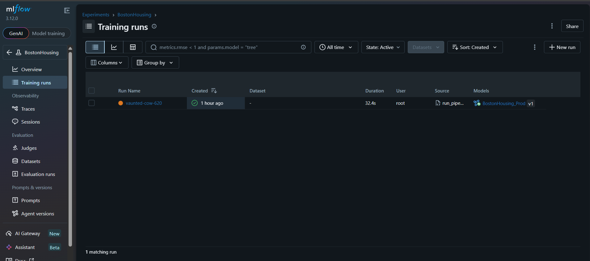

# MercadoLibre - Boston Housing Prediction Service

## Overview

Este proyecto es una solución integral de Machine Learning para la predicción de precios de viviendas (Boston Housing), diseñada bajo los estándares de **Clean Architecture** y principios de **MLOps**. El sistema proporciona una API de inferencia escalable y un pipeline de entrenamiento automatizado con seguimiento detallado de experimentos.

## Key Features

🚀 **Servicio de Inferencia**
* API REST de alto rendimiento construida con **FastAPI**.
* Validación estricta de datos de entrada (features) mediante **Pydantic**.
* Soporte flexible para recibir características tanto en formato de diccionario como de lista.

🧪 **MLOps & Experimentación**
* Rastreo de experimentos (métricas RMSE, MAE, R²) y registro de modelos mediante **MLflow**.
* Pipeline de entrenamiento persistente que genera artefactos versionados automáticamente.
* Carga dinámica y automática del modelo más reciente ("latest") en caliente.

🏗️ **Arquitectura y DevOps**
* Estricta separación de capas siguiendo **Clean Architecture** (Dominio, Aplicación, Infraestructura).
* Orquestación completa del stack (API + MLflow) mediante **Docker Compose**.
* CI/CD automatizado con GitHub Actions y Runners locales.
* Monitoreo mediante MLflow Tracking Server.

## Architecture

The project follows Clean Architecture principles with clear separation of concerns:

```ini
📁 MercadoLibre/
├── 📂 .github/workflows/        # Automatización CI/CD
│   ├── 📄 ci.yml                # Tests, cobertura y construcción de imagen Docker
│   └── 📄 cd.yml                # Despliegue continuo mediante Docker Compose
├── 📂 data/                     # Almacenamiento de datos (Versionado local)
│   ├── 📂 raw/                  # Dataset original (boston_housing.csv)
│   └── 📂 processed/            # Datos limpios tras Fase 1 (boston_clean.csv)
├── 📂 deployment/               # Archivos de infraestructura agnóstica
│   ├── 📄 Dockerfile            # Empaquetado de la API FastAPI
│   └── 📄 docker-compose.yml    # Orquestación de API + MLflow Tracking Server
├── 📂 models/                   # Artefactos del modelo
│   ├── 📄 latest.txt            # Puntero al nombre del archivo .joblib más reciente
│   └── 📄 model_*.joblib        # Modelos entrenados y persistidos
├── 📂 src/boston_housing/       # Código fuente principal
│   ├── 📂 application/          # Capa de Orquestación
│   │   ├── 📄 app.py            # Punto de entrada de la aplicación FastAPI
│   │   └── 📂 config/           # Contenedor de Inyección de Dependencias
│   ├── 📂 domain/               # Capa de Lógica de Negocio (Pura)
│   │   ├── 📂 model/            # Entidades de dominio (Housing)
│   │   ├── 📂 model/gateway/    # Interfaces de repositorios (Abstracciones)
│   │   └── 📂 usecase/          # Casos de uso (Preprocess, Train, Evaluate)
│   └── 📂 infrastructure/       # Capa de Adaptadores e Implementaciones
│       ├── 📂 driven_adapters/  # Persistencia de modelos y repositorios CSV
│       └── 📂 entry_points/     # API Routes, CLI Scripts (run_pipeline, etc.)
├── 📂 tests/                    # Pruebas unitarias con Pytest
├── 📄 HousingData.csv           # Dataset raw para pruebas rápidas
├── 📄 pyproject.toml            # Configuración de dependencias (uv/hatchling)
├── 📄 uv.lock                   # Lockfile de dependencias para reproducibilidad
├── 📄 main.py                   # Punto de entrada principal
└── 📄 README.md                 # Documentación del proyecto
```

## Technology Stack

* **Lenguaje & Gestor**: [Python 3.13](https://www.python.org/) + [uv](https://docs.astral.sh/uv/) (Package Management).
* **Machine Learning**: [Scikit-learn](https://scikit-learn.org/) (Ridge Regression & Pipelines), [Pandas](https://pandas.pydata.org/), [NumPy](https://numpy.org/).
* **MLOps**: [MLflow](https://mlflow.org/) (Experiment Tracking & Model Registry).
* **API Framework**: [FastAPI](https://fastapi.tiangolo.com/) + [Pydantic v2](https://docs.pydantic.dev/) para validación de datos.
* **Arquitectura**: Clean Architecture con Inyección de Dependencias ([Dependency Injector](https://python-dependency-injector.ets-labs.org/)).
* **DevOps & CI/CD**: [Docker](https://www.docker.com/), [Docker Compose](https://docs.docker.com/compose/) y [GitHub Actions](https://github.com/features/actions) Y  GitHub Actions Runners.
* **Persistencia**: [Joblib](https://joblib.readthedocs.io/) para modelos y almacenamiento local para datasets CSV.
* **Testing**: [Pytest](https://docs.pytest.org/) con soporte para pruebas asíncronas y reportes de cobertura.

## Prerequisites

Antes de comenzar, asegúrate de tener instalado lo siguiente:

* **Python 3.11+**: Versión base del proyecto. Puedes instalarla fácilmente ejecutando `uv python install`.
* **Requirements**: Paquetes de python, instalarlos con pip install -r requerimientos.txt`.
* **crear runer en GitHub**: 
* **Docker & Docker Compose**: Necesarios para ejecutar el stack completo (API + MLflow) de forma aislada.

## Dockerfile y ejemplos de uso. 
* **Levantar dokcerr compose**: docker compose -f deployment/docker-compose.yml up --build**


## Local development
1. python main.py
2. python src\boston_housing\infrastructure\entry_points\run_pipeline.py
3. http://127.0.0.1:8000/health
4. curl postman inferencia
    curl --location 'http://127.0.0.1:8000/predict' \
    --header 'Content-Type: application/json' \
    --data '{
        "features": [
            6.575,
            4.98,
            15.3,
            4.09,
            0.538,
            0.00632,
            296,
            65.2
        ]
    }'
5. iniciar runners: ./run.cmd
6. swagger 
    - http://localhost:8000/apidocs/
7. Levanta docker compose : docker compose -f deployment/docker-compose.yml up --build
8. UI MLflow : http://localhost:5000/


## Pipeline CI/CD


## monitoreo

    